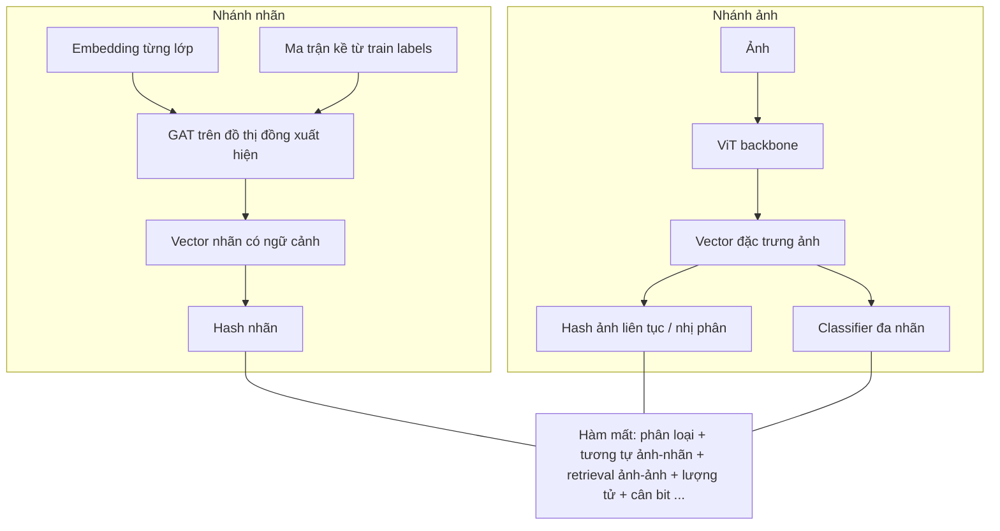

# Báo cáo lý thuyết — Mô hình G-hash và cách toàn hệ thống CBIR hoạt động

Tài liệu này trình bày **lý thuyết và nguyên lý** của kiến trúc **G-hash** (Graph Attention Hashing) trong bối cảnh **truy vấn ảnh theo nội dung (CBIR)** với **nhãn đa nhãn (multi-label)**. Mục tiêu là đọc một lần có thể **nắm toàn bộ bức tranh**: bài toán → biểu diễn → đồ thị nhãn → học hash → hàm mất → huấn luyện → truy vấn → đánh giá.

*(Triển khai cụ thể trong repo: tham thêm `BAO_CAO_MO_HINH_GHASH_VA_DAN_CHUNG_CODE.md` và `BAO_CAO_HE_THONG_VAN_HANH_CODE.md`.)*

---

## 1. Bài toán đặt ra

### 1.1. CBIR là gì?

**Truy vấn ảnh theo nội dung (Content-Based Image Retrieval)** là bài toán: cho một **ảnh truy vấn (query)** và một **kho ảnh (gallery / database)**, hệ thống trả về các ảnh trong kho **giống về mặt ngữ nghĩa nội dung** với query, không dựa vào từ khóa do người gõ.

Trong môi trường lớp học, “giống” thường được mô hình hóa bằng **tập hành vi / trạng thái** (ví dụ: đang đọc, đang dùng điện thoại, đang viết, …). Một ảnh có thể thể hiện **nhiều hành vi cùng lúc** → đây là **phân loại đa nhãn (multi-label)**.

### 1.2. Ký hiệu chung

- Kho ảnh huấn luyện: \(N\) mẫu, mỗi ảnh \(i\) có vector nhãn **multi-hot**  
  \(\mathbf{y}_i \in \{0,1\}^C\), với \(C\) là số lớp.  
  Thành phần \(y_{ic}=1\) nghĩa là ảnh \(i\) **có** lớp \(c\).

- Mục tiêu học: một hàm ánh xạ ảnh → **mã băm nhị phân ngắn** \(\mathbf{h}_i \in \{-1,+1\}^K\) (với \(K\) là số bit, ví dụ 64) sao cho:
  - Ảnh **cùng ít nhất một nhãn** có mã **gần nhau** (khoảng cách Hamming nhỏ).
  - Có thể **dự đoán nhãn** (xác suất từng lớp) để hỗ trợ giải thích và re-rank.

### 1.3. Vì sao cần hashing?

- So khớp trực tiếp vector đặc trưng liên tục (vài trăm chiều) trên kho lớn tốn bộ nhớ và thời gian.
- **Mã nhị phân** cho phép:
  - Lưu trữ gọn (bit).
  - So sánh nhanh bằng **XOR / tích vô hướng** (tương đương Hamming).
  - Dễ lập chỉ mục (cấu trúc dữ liệu chuyên biệt, hoặc quét toàn bộ nếu kho vừa phải).

**Deep hashing** học mã này **end-to-end** cùng với backbone mạng sâu, thay vì hash tay (LSH cổ điển trên đặc trưng SIFT, v.v.).

---

## 2. Tổng quan kiến trúc G-hash (hai nhánh + một đồ thị nhãn)

G-hash kết hợp ba ý tưởng:

1. **Nhánh ảnh:** Trích **đặc trưng toàn cục** mạnh (ở đây: **Vision Transformer — ViT**) → chiếu xuống không gian hash **liên tục** (thường qua tanh để giới hạn \([-1,1]\)) → khi cần dùng **dấu (sign)** thành mã nhị phân.

2. **Nhánh nhãn:** Mỗi lớp \(c\) có một **embedding** (vector học được). Các lớp không độc lập: trong dữ liệu thực tế, một số cặp nhãn **đồng xuất hiện** thường xuyên (ví dụ “ngồi” và “đọc”). Ta mô hình hóa bằng **đồ thị có hướng trọng số** trên \(C\) nút (mỗi nút là một lớp), với ma trận kề lấy từ **thống kê đồng xuất hiện trên tập huấn luyện**.

3. **GAT (Graph Attention Network):** Trên đồ thị đó, mỗi nút nhãn **tổng hợp thông tin** từ các láng giềng được phép kết nối, với **trọng số chú ý** học được — tức là embedding sau GAT mang **ngữ cảnh đồng hiện nhãn**, không chỉ là một vector tĩnh cho từng lớp.

4. **Hash nhãn:** Vector nhãn sau GAT được chiếu thành **mã hash cho từng lớp** (cùng không gian bit với hash ảnh), để **căn chỉnh (align)** đặc trưng ảnh với đặc trưng nhãn trong không gian Hamming / cosine.

Sơ đồ khái niệm:

---

## 3. Vision Transformer (ViT) — vai trò trong nhánh ảnh

### 3.1. Ý tưởng ngắn gọn

ViT **chẻ ảnh** thành các **patch** (ví dụ 16×16), **mã hóa tuyến tính + vị trí** thành chuỗi token, rồi dùng **cơ chế tự chú ý (self-attention)** như Transformer trong NLP. Token **CLS** (hoặc tương đương) gom thông tin toàn ảnh → một vector đặc trưng **toàn cục**, phù hợp làm đầu vào cho hash và classifier.

### 3.2. Vì sao ViT phù hợp CBIR giáo dục?

- Bối cảnh lớp học có **biến thể ánh sáng, góc chụp, tư thế**; attention trên patch giúp **nhìn toàn cục** và **nhấn vùng** liên quan hành vi tốt hơn nhiều CNN nông nếu dữ liệu đủ huấn luyện.

### 3.3. Trong pipeline G-hash

Vector đầu ra ViT \(\mathbf{f}^{\text{img}}_i \in \mathbb{R}^D\) được đưa qua các lớp **chuẩn hóa / phi tuyến / chiếu tuyến tính** để thu được vector hash liên tục trước khi lượng tử hóa:

\[
\mathbf{z}^{\text{img}}_i = \tanh\left( W_{\text{img}}(\mathbf{f}^{\text{img}}_i) \right) \in [-1,1]^K
\]

(Trong triển khai, chiều trung gian “hidden” có thể lớn hơn \(K\) trước khi chiếu xuống \(K\) bit.)

---

## 4. Đồ thị đồng xuất hiện nhãn (Label co-occurrence graph)

### 4.1. Ý nghĩa thống kê

Từ toàn bộ nhãn huấn luyện, ta đếm **bao nhiêu ảnh có cả nhãn \(i\) và nhãn \(j\)**. Ma trận đồng hiện thô \(N_{ij}\) phản ánh **mức độ “đi cùng nhau”** của hai lớp trong dữ liệu.

Để có trọng số kề **chuẩn hóa** (tránh lệch do lớp phổ biến), có thể dùng xác suất có điều kiện kiểu:

\[
A_{ij} \propto P(\text{lớp } i \text{ bật} \mid \text{lớp } j \text{ bật})
\]

(thể hiện cụ thể trong mã là chia từng cột cho tổng số mẫu dương của lớp cột, cộng self-loop trên đường chéo.)

### 4.2. Vai trò trong G-hash

- Ma trận \(\mathbf{A}\) **không** học bằng gradient; nó là **đặc trưng cấu trúc tĩnh** của tập huấn luyện (có thể cập nhật lại nếu dữ liệu thay đổi).
- GAT dùng \(\mathbf{A}\) để **mask**: chỉ cho phép truyền tin giữa các cặp nhãn có cạnh (trọng số > 0). Nhờ đó, **nhãn hiếm nhưng hay đi cặp với nhãn khác** vẫn nhận được thông tin láng giềng có cấu trúc.

---

## 5. Graph Attention Network (GAT) trên nút nhãn

### 5.1. Bài toán trên đồ thị

Cho \(C\) nút, mỗi nút có vector đặc trưng ban đầu \(\mathbf{e}_c\) (embedding lớp \(c\)). Ta muốn tính \(\mathbf{e}'_c\) mới sao cho **phụ thuộc cả bản thân và láng giềng** trên đồ thị có hướng/trọng số \(\mathbf{A}\).

### 5.2. Cơ chế attention (ý tưởng Veličković et al.)

Với mỗi cặp nút \((c, d)\) có cạnh (theo mask), tính một **điểm tương thích** (thường qua LeakyReLU và vector attention \(\mathbf{a}\)). Sau đó **chuẩn hóa softmax** trên **tất cả láng giềng được phép** của \(c\):

\[
\alpha_{cd} = \text{softmax}_d\left( \text{score}(\mathbf{W}\mathbf{e}_c, \mathbf{W}\mathbf{e}_d) \right)
\]

Vector mới:

\[
\mathbf{e}'_c = \sigma\left( \sum_{d \in \mathcal{N}(c)} \alpha_{cd} \mathbf{W}\mathbf{e}_d \right)
\]

### 5.3. Multi-head

Nhiều **đầu chú ý** học các kiểu “láng giềng quan trọng” khác nhau; đầu ra có thể **nối (concat)** ở lớp giữa rồi nén ở lớp cuối — tăng biểu diễn cho đồ thị nhãn phức tạp.

### 5.4. Liên hệ với hashing

Sau GAT, ta có \(\tilde{\mathbf{e}}_c\) — “**nhãn trong ngữ cảnh đồ thị**”. Chiếu xuống không gian bit:

\[
\mathbf{z}^{\text{txt}}_c = \tanh\left( W_{\text{txt}}(\tilde{\mathbf{e}}_c) \right)
\]

Cả \(\mathbf{z}^{\text{img}}\) và \(\mathbf{z}^{\text{txt}}_c\) nằm trong cùng \(\mathbb{R}^K\), phục vụ các loss **căn chỉnh đa phương thức**.

---

## 6. Phân loại đa nhãn (nhánh phụ trợ nhưng quan trọng)

Song song với hash, một **classifier** (thường trên \(\mathbf{f}^{\text{img}}\)) xuất logits \(\mathbf{o}_i \in \mathbb{R}^C\). Với multi-label, chuẩn hóa xác suất từng lớp bằng **sigmoid độc lập** (không softmax toàn vecto):

\[
p_{ic} = \sigma(o_{ic})
\]

Hàm mất phân loại: **Binary Cross-Entropy (BCE)** tổng qua lớp, có thể **cân trọng số** theo tần suất lớp (nhãn hiếm được nhấn mạnh hơn) để giảm lệch.

Classifier giúp:
- **Giám sát mạnh** không gian đặc trưng ảnh theo nhãn.
- **Giải thích** và **re-rank** ở ứng dụng (so khớp phân phối nhãn query–gallery).

---

## 7. Hàm mất tổng hợp — lý thuyết từng nhóm

Ký hiệu gọn: \(\mathcal{L}_{\text{total}} = \gamma \mathcal{L}_{\text{cls}} + \alpha \mathcal{L}_{\text{sim}} + \eta \mathcal{L}_{\text{ret}} + \beta \mathcal{L}_{\text{quant}} + \mathcal{L}_{\text{ortho}} + \delta \mathcal{L}_{\text{bb}}\) (hệ số đọc từ cấu hình thực nghiệm).

### 7.1. \(\mathcal{L}_{\text{cls}}\) — Phân loại đa nhãn

Kéo \(\mathbf{o}_i\) sao cho \(p_{ic} \approx y_{ic}\). Đây là **neo ngữ nghĩa** trực tiếp từ nhãn.

### 7.2. \(\mathcal{L}_{\text{sim}}\) — Tương tự ảnh ↔ hash nhãn

Ý tưởng: Với ảnh \(i\), hash \(\mathbf{z}^{\text{img}}_i\) nên **gần (cosine cao)** với hash của các lớp \(c\) mà \(y_{ic}=1\), và **xa** với lớp không có. Điều này **buộc không gian hash** phản ánh cấu trúc nhãn đa phương thức (ảnh + không gian nhãn sau GAT).

### 7.3. \(\mathcal{L}_{\text{ret}}\) — Retrieval ảnh–ảnh có giám sát

Trong cùng batch, hai ảnh được coi **positive** nếu \(\mathbf{y}_i^\top \mathbf{y}_j > 0\) (cùng ít nhất một nhãn), **negative** nếu không có nhãn chung. Loss khuyến khích **tích vô hướng / tương tự** giữa các cặp positive lớn hơn negative — thẳng hàng với mục tiêu **tìm ảnh giống nhau trong kho**.

### 7.4. \(\mathcal{L}_{\text{quant}}\) — Lượng tử hóa

Hash thực tế cần \(\{-1,+1\}^K\). Trong lúc train, vector liên tục \(\mathbf{z}\) được ép **gần** với \(\text{sign}(\mathbf{z})\) (chuẩn bị cho bước sign ở inference), giảm **khe lượng tử hóa (quantization gap)**.

### 7.5. \(\mathcal{L}_{\text{ortho}}\) — Trực giao hash nhãn

Khuyến khích các vector hash **của các lớp khác nhau** không bị **dính chùm** trong không gian (gần tương đương ma trận Gram gần đơn vị). Giúp **tách biệt khái niệm** trong không gian bit, tránh mô hình “đổ tất cả nhãn vào một vài hướng”.

### 7.6. \(\mathcal{L}_{\text{bb}}\) — Cân bằng bit (bit balance)

Ép **trung bình theo batch** của từng bit gần 0 (hoặc phân phối bit không lệch hẳn về +1 hoặc -1). **Bit cân bằng** thường cho **mã thông tin cao hơn**, giảm **sụp mode (mode collapse)** toàn mã giống nhau.

---

## 8. Huấn luyện end-to-end

1. **Khởi tạo:** ViT pretrained; embedding nhãn và GAT ngẫu nhiên (hoặc chiến lược fine-tune từ checkpoint khác nếu có).

2. **Tiền tính toán:** Duyệt một lượt `train_loader`, ghép tất cả \(\mathbf{y}_i\), tính ma trận kề đồng xuất hiện \(\mathbf{A}\), đưa lên GPU.

3. **Mỗi epoch:** Với từng batch ảnh–nhãn:
   - Forward: ViT → hash ảnh; embedding → GAT → hash nhãn; classifier.
   - Loss tổng như mục 7.
   - Backprop qua **toàn bộ** ViT + GAT + các đầu hash (trừ \(\mathbf{A}\) cố định).

4. **Đánh giá định kỳ:** Mã hóa ảnh query và database bằng **sign** trên nhánh ảnh; xếp hạng theo **Hamming**; tính mAP, Precision@K, Recall@K theo định nghĩa “relevant = cùng ít nhất một nhãn”.

5. **Early stopping / lưu checkpoint** theo mAP hoặc metric chủ đạo.

---

## 9. Truy vấn (inference) — lý thuyết hai tầng

### 9.1. Tầng 1: Tìm kiếm thô theo Hamming

Với query \(\mathbf{h}^q \in \{-1,+1\}^K\) và gallery \(\{\mathbf{h}^j\}\), khoảng cách Hamming:

\[
d_H(\mathbf{h}^q, \mathbf{h}^j) = \frac{K - \mathbf{h}^q \cdot \mathbf{h}^j}{2}
\]

(đối với mã ±1). Sắp xếp \(d_H\) tăng dần → danh sách ứng viên nhanh.

### 9.2. Tầng 2: Re-ranking (ứng dụng)

Hamming **mất thông tin** do lượng tử hóa. Trong sản phẩm, có thể lấy **top-M ứng viên** từ Hamming, rồi **tính lại điểm** từ:
- Độ tương tự **hash liên tục** (trước sign),
- Độ tương thích **phân phối nhãn** (ví dụ cosine giữa vector xác suất),
- (tùy) khoảng cách Hamming với trọng số nhỏ.

Điều này **không** thay thế định nghĩa metric báo cáo thuần Hamming, nhưng **cải thiện trải nghiệm người dùng** và đa dạng kết quả (tránh trùng cùng video).

---

## 10. Đánh giá (metrics) — hiểu đúng để báo cáo

- **mAP (mean Average Precision):** Với mỗi query, xếp hạng gallery theo Hamming; tính **Average Precision** trên các ảnh **relevant** (cùng ít nhất một nhãn); trung bình trên query. **mAP@K** chỉ xét **K** ảnh đầu trong danh sách đã sắp.

- **Precision@K:** Trong top-K, tỉ lệ ảnh relevant.

- **Recall@K:** Trong top-K, số relevant **chia** cho **tổng số relevant của query trong toàn gallery**. Khi gallery rất lớn và mỗi lớp có rất nhiều ảnh, Recall@K có thể **thấp** dù Precision@K / mAP@K vẫn tốt — cần giải thích đúng khi hội đồng hỏi.

---

## 11. Baseline (khái niệm so sánh)

Một **baseline** điển hình: **cùng hashing + classifier** nhưng **bỏ GAT** (hash nhãn đơn giản hơn hoặc chỉ nhánh ảnh). Nếu GAT cải thiện mAP hoặc tính ổn định trên nhãn đồng hiện, đó là **bằng chứng** đồ thị nhãn có ích cho bài toán đa nhãn.

---

## 12. Giới hạn lý thuyết và thực tiễn

| Vấn đề | Giải thích |
|--------|------------|
| Ma trận kề cố định theo train | Phản ánh **phân bố train**; lệch domain (lớp mới, cách gán nhãn khác) có thể làm kề “sai ngữ cảnh”. |
| Lượng tử sign | Gradient qua sign không trơn; thực tế dùng **hash liên tục + loss lượng tử** để hạ lỗi. |
| Đa nhãn mơ hồ | “Cùng một nhãn” không luôn đồng nghĩa “hình ảnh giống nhau về tư thế”; metric chỉ là **proxy**. |
| Chi phí GAT | Với \(C\) nhỏ (vài chục lớp), GAT rất nhẹ so với ViT; nút thật sự là **số lớp**, không phải số ảnh. |

---

## 13. Kết luận — một dòng chảy lý thuyết

**G-hash** học đồng thời: (i) **đặc trưng ảnh mạnh** (ViT), (ii) **cấu trúc thống kê giữa các nhãn** (đồ thị đồng xuất hiện), (iii) **tinh chỉnh embedding nhãn bằng GAT**, (iv) **mã hóa ảnh và nhãn vào cùng không gian hash**, (v) **tối ưu tổ hợp loss** để vừa phân loại đúng, vừa retrieval theo Hamming. Hệ thống hoàn chỉnh còn gồm **pipeline dữ liệu** (crop, nhãn, chia tập) và **tầng suy luận** (Hamming + tùy chọn re-rank).

---

*Tệp:* `BAO_CAO_LY_THUYET_MO_HINH_GHASH.md` — báo cáo lý thuyết; không thay thế tài liệu chỉ dẫn mã hay runbook vận hành.*
