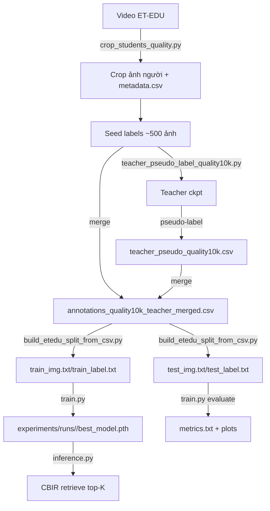

# BÁO CÁO LUỒNG CHẠY CODE – Hệ thống CBIR ET-EDU (G-hash + GAT)

**Run tham chiếu:** `experiments/runs/20260420-115433`  
**Mục tiêu báo cáo:** mô tả **toàn bộ hệ thống chạy theo từng bước** (từ video → crop → nhãn → split → train/eval → inference), bám sát đúng các file entrypoint và luồng gọi hàm trong code.

---

## 0) Tóm tắt 30 giây (để trình bày)

- **Input**: video lớp học (ET-EDU) + một phần nhãn seed thủ công.
- **Output**: 
  - Ảnh crop chất lượng cao + metadata,
  - CSV nhãn merged,
  - file split `train_img.txt / train_label.txt / test_img.txt / test_label.txt`,
  - model `best_model.pth` + `metrics.txt` + biểu đồ,
  - demo truy hồi bằng `inference.py`.
- **5 bước chạy chính**:
  1) Crop người từ video → dataset ảnh.
  2) Seed → train teacher → pseudo-label → merge nhãn.
  3) Split train/test theo video để tránh leakage.
  4) Train G-hash (ViT + Hashing + GAT) + evaluate retrieval.
  5) Inference: query → hash → Hamming → (rerank + diversify) → top-K.

---

## 1) “Entry points” (scripts) và vai trò

| Bước | Script | Vai trò | Input | Output |
|---|---|---|---|---|
| 1 | `crop_students_quality.py` | Cắt crop người chất lượng cao từ video | `data/ET-EDU/` | `data/cropped_students_quality_10k/*.jpg` + `metadata.csv` |
| 2 | `teacher_pseudo_label_quality10k.py` | Seed → train teacher → pseudo-label → merge | `seed_annotations_quality10k.csv` + ảnh crop | `teacher_pseudo_quality10k.csv` + `annotations_quality10k_teacher_merged.csv` |
| 3 | `build_etedu_split_from_csv.py` | Split train/test theo video_id | merged CSV | `data/train_img.txt`, `data/train_label.txt`, `data/test_img.txt`, `data/test_label.txt`, `data/concepts.txt` |
| 4 | `train.py` | Train + evaluate + xuất artifacts | config YAML + data txt | `experiments/runs/<time>/*` |
| 5 | `inference.py` | Predict nhãn hoặc retrieve ảnh tương tự | checkpoint + query + database | top-K kết quả + (tuỳ chọn) ảnh minh hoạ |

---

## 2) Cấu trúc “core library” trong `src/`

- `src/data/`
  - `dataset.py`: đọc `*_img.txt` + `*_label.txt`, tạo DataLoader.
  - `label_graph.py`: build adjacency nhãn từ co-occurrence.
- `src/models/`
  - `vision_encoder.py`: ViT encoder từ `timm`.
  - `gat.py`: Graph Attention Network cho nhãn.
  - `ghash.py`: model chính (Image stream + Label stream + Classifier).
- `src/training/`
  - `losses.py`: `GHashLoss` (cls + sim + retrieval + quant + ortho + bit_balance).
  - `trainer.py`: vòng lặp train/eval, save checkpoint.
- `src/evaluation/`
  - `metrics.py`: Hamming distance, mAP, P@K, R@K, PR@radius.
- `src/utils/`
  - `config.py`: đọc YAML config + chọn device + set seed.
  - `visualization.py`: sinh biểu đồ + ghi `metrics.txt`.

---

## 3) Chuẩn dữ liệu & format file (hệ thống dùng gì để chạy)

### 3.1 Ảnh crop (sau bước 1)
- Lưu ở: `data/cropped_students_quality_10k/*.jpg`.
- Tên file có chứa thông tin bucket + video + frame, ví dụ:
  - `near_<video_stem>_f000123_p00_00000045.jpg`

### 3.2 CSV nhãn (seed / pseudo / merged)
- Cột bắt buộc:
  - `Image_Path` (đường dẫn *tương đối* tính từ `data_root`, ví dụ `cropped_students_quality_10k/xxx.jpg`)
  - 14 cột nhãn: `using_phone, dozing_off, ..., interacting` (0/1).

### 3.3 File split train/test (đầu vào trực tiếp của training)
- `data/train_img.txt`: mỗi dòng là 1 path tương đối (ví dụ `cropped_students_quality_10k/xxx.jpg`).
- `data/train_label.txt`: mỗi dòng là 14 số 0/1, cách nhau bởi khoảng trắng.
- Tương tự cho `data/test_img.txt`, `data/test_label.txt`.

### 3.4 Config YAML
- Ví dụ cấu hình run ET-EDU: `configs/et_edu_config.yaml`.
- Các nhóm chính:
  - `dataset`: `name`, `data_root`, `num_classes`, `image_size`.
  - `model`: `image_encoder`, `hash_bits`, `hidden_dim`, `dropout`, ...
  - `training`: `batch_size`, `num_epochs`, `learning_rate`, ...
  - `loss`: các weight alpha/beta/gamma/eta/delta.
  - `evaluation`: `top_k`, `database_split`.
  - `save_dir`: nơi lưu run.

---

## 4) Pipeline chạy end-to-end (các lệnh tiêu chuẩn)

> Các lệnh dưới đây mô tả đúng “đường đi” của hệ thống trong repo.

### Bước 1 — Crop từ video
```bash
python crop_students_quality.py \
  --video-dir data/ET-EDU \
  --output-dir data/cropped_students_quality_10k \
  --metadata-csv data/cropped_students_quality_10k/metadata.csv \
  --target-count 10000 \
  --seconds-per-frame 2.5
```

### Bước 2 — Seed → teacher → pseudo-label → merge
```bash
python teacher_pseudo_label_quality10k.py \
  --seed-csv data/seed_annotations_quality10k.csv \
  --input-dir data/cropped_students_quality_10k \
  --merged-output-csv data/annotations_quality10k_teacher_merged.csv
```

### Bước 3 — Split train/test theo video
```bash
python build_etedu_split_from_csv.py \
  --csv-file data/annotations_quality10k_teacher_merged.csv \
  --output-root data
```

### Bước 4 — Train + evaluate
```bash
python train.py --config configs/et_edu_config.yaml
```

### Bước 5 — Inference / demo truy hồi
> Lưu ý: `inference.py` có default config không tồn tại trong repo, nên **phải truyền `--config`**.

```bash
python inference.py \
  --checkpoint experiments/runs/20260420-115433/best_model.pth \
  --config configs/et_edu_config.yaml \
  --mode retrieve \
  --image PATH_TO_QUERY.jpg \
  --database data/train_img.txt \
  --top-k 5 \
  --save-viz
```

---

## 5) Luồng chạy code chi tiết (theo thứ tự thực thi)

### 5.1 Bước 1 – Crop ảnh từ video: `crop_students_quality.py`

**Mục tiêu:** từ video → phát hiện người → cắt crop rõ nét → giữ đủ đa dạng khoảng cách.

**Luồng chạy chính:**
1) `parse_args()` đọc ngưỡng chất lượng (conf/size/area/blur/padding), sampling, quota near/mid/far.
2) `calc_quotas()` tính số lượng ảnh muốn giữ cho từng bucket.
3) Khởi tạo `BucketKeeper`:
   - Mỗi bucket có 1 heap để giữ **top ảnh theo `quality_score()`**.
4) Nạp YOLO: `model = YOLO(args.model_path)`.
5) Với mỗi video:
   - `cv2.VideoCapture` → tính `fps` → suy ra `frame_step = fps * seconds_per_frame`.
   - Mỗi `frame_step` frame:
     - `model.predict(frame)` lấy bbox người (class=person).
     - Lọc bbox theo:
       - `conf >= min_conf`, `bw/bh >= min_width/min_height`, `area_ratio >= min_area_ratio`.
     - Pad bbox theo `padding_ratio` để giữ ngữ cảnh hành vi.
     - Tính độ nét `sharpness = Laplacian(gray).var()` và lọc `sharpness >= blur_threshold`.
     - (Tuỳ chọn) enhance crop: CLAHE + unsharp + denoise.
     - Gán bucket theo `get_bucket(area_ratio)`.
     - Tính `score = quality_score(conf, sharpness, area_ratio, min_area_ratio)`.
     - `keeper.try_add(...)`:
       - nếu bucket chưa đủ quota → ghi file crop.
       - nếu đã đủ quota → chỉ ghi đè khi `score` tốt hơn ảnh yếu nhất.
6) Kết thúc:
   - `keeper.all_records()` → ghi `metadata.csv` gồm: path, bucket, score, video_name, frame_idx, conf, sharpness, area_ratio, bbox, w/h.

**Output:**
- Ảnh crop: `data/cropped_students_quality_10k/*.jpg`
- Metadata: `data/cropped_students_quality_10k/metadata.csv`

### 5.2 Bước 2 – Seed → teacher → pseudo-label → merge: `teacher_pseudo_label_quality10k.py`

**Mục tiêu:** giảm công manual bằng teacher, nhưng vẫn kiểm soát bằng seed + giới hạn per-class.

**Luồng chạy chính:**
1) `SeedDataset` đọc `seed_annotations_quality10k.csv`:
   - Mỗi dòng: `Image_Path` + 14 cột nhãn.
   - Trả về (image_tensor, labels_tensor).
2) `train_teacher()`:
   - Model: ResNet18 pretrained, thay `fc` thành `Dropout + Linear(num_classes)`.
   - Tính `pos_weight` từ seed để cân bằng lớp (clip 1..15).
   - Train BCEWithLogitsLoss trong `epochs` + scheduler CosineAnnealingLR.
   - Lưu checkpoint teacher: `experiments/teacher_quality10k_seed500.pth`.
3) `pseudo_label_remaining()`:
   - Liệt kê ảnh “còn lại” trong `input_dir` nhưng chưa nằm trong seed.
   - Với mỗi ảnh:
     - chạy teacher → `probs = sigmoid(logits)`.
     - lấy `top_k` nhãn cao nhất.
     - bật nhãn nếu `prob >= threshold` (và luôn giữ nhãn top-1).
     - áp giới hạn `max_per_class` để tránh một số lớp tràn.
     - nếu không có nhãn nào sau lọc → bỏ qua.
   - Trả ra `pseudo_rows`.
4) `merge_seed_and_pseudo()`:
   - Ghi seed trước, sau đó thêm pseudo (không trùng `Image_Path`).
   - Output merged CSV.

**Output:**
- Pseudo CSV: `data/teacher_pseudo_quality10k.csv`
- Merged CSV: `data/annotations_quality10k_teacher_merged.csv`

### 5.3 Bước 3 – Split train/test theo video: `build_etedu_split_from_csv.py`

**Mục tiêu:** tránh leakage: ảnh cùng video không được rơi vào cả train và test.

**Luồng chạy chính:**
1) Đọc merged CSV, lấy `classes = header[1:]`.
2) Deduplicate theo `Image_Path`.
3) Gom nhóm theo `video_id_from_path()`:
   - parse từ tên file (tách theo `_`): lấy `parts[1] + '_' + parts[2]`.
4) Tìm tập video train sao cho:
   - gần với `target_train_ratio` (mặc định 0.8),
   - số video test ≥ `min_test_videos`.
   - Code duyệt tổ hợp video để tìm combo tốt nhất.
5) Xuất 5 file:
   - `train_img.txt`, `test_img.txt`, `train_label.txt`, `test_label.txt`, `concepts.txt`.

### 5.4 Bước 4 – Training entrypoint: `train.py`

**Call chain tổng quát:**
`train.py` → tạo DataLoader → build model/loss → `Trainer.train()` → evaluate → xuất report.

**Luồng chạy chính:**
1) Load config YAML bằng `Config(args.config)`.
2) `set_seed(config['seed'])`.
3) Chọn device: `config.device`.
4) `create_data_loaders(config.config)` (ở `src/data/dataset.py`):
   - Đọc `data/train_img.txt`, `data/train_label.txt` (train) và `data/test_*` (test/query).
   - Trả về `train_loader`, `test_loader`, `query_loader`.
5) `compute_pos_weight(train_loader)`:
   - Ước lượng pos_weight từ toàn train set; clamp 1..10.
6) Build model:
   - Mặc định: `GHashModel` (ViT + GAT).
   - Tuỳ chọn baseline: `BaselineModel`.
   - (Tuỳ chọn) load transfer checkpoint: chỉ nạp các tensor cùng shape.
7) Build criterion: `GHashLoss(...)`.
8) `Trainer(...).train()`:
   - train theo epoch,
   - evaluate mỗi 5 epoch,
   - save `best_model.pth` theo mAP,
   - checkpoint mỗi 10 epoch,
   - early stopping theo patience.
9) Evaluate final và gọi `create_experiment_report(...)` (ở `src/utils/visualization.py`):
   - vẽ `training_curves.png`, `loss_components.png`, `topk_metrics.png`, `pr_curve.png`,
   - ghi `metrics.txt` (metrics + dump config).

### 5.5 Data loader chi tiết: `src/data/dataset.py`

- Dataset class: `NUSWIDE2Dataset` (dùng chung cho NUS-WIDE và ET-EDU).
- Với `dataset.name == 'ET-EDU'`:
  - split `database` đọc `train_img.txt` + `train_label.txt`.
  - split `test` đọc `test_img.txt` + `test_label.txt`.
- `__getitem__`:
  1) Mở ảnh bằng PIL, convert RGB.
  2) Apply transform:
     - train: RandomResizedCrop + Flip + ColorJitter + Rotation + Normalize.
     - test/query: Resize + Normalize.
  3) Return `(image_tensor, label_tensor, idx)`.

### 5.6 Trainer chi tiết: `src/training/trainer.py`

**Khởi tạo (`__init__`)**
- Optimizer: Adam.
- Scheduler: CosineAnnealingLR.
- Xây `adj_matrix` bằng `_build_adjacency_matrix()`:
  - gom toàn bộ label từ train_loader → `build_label_cooccurrence_matrix`.
- Tạo `save_dir = experiments/runs/<timestamp>`.

**Train epoch (`train_epoch`)**
- Với mỗi batch:
  1) `img_hash, txt_hash, pred_labels = model(images, labels, adj_matrix)`
  2) `loss, loss_dict = criterion(img_hash, txt_hash, pred_labels, labels)`
  3) backprop + clip grad + optimizer step.

**Evaluate (`evaluate`)**
- Encode database:
  - `codes = model.generate_hash_code(images)` → mã nhị phân {-1,+1}.
- Encode query:
  - tương tự với `query_loader`.
- `compute_retrieval_metrics(...)` để lấy mAP, P@K, R@K, PR@radius.

**Checkpoint**
- Best: `best_model.pth`.
- Periodic: `checkpoint_epoch_<epoch>.pth`.

### 5.7 Model chi tiết: `src/models/ghash.py`

- `VisionEncoder` (ViT) → `img_features`.
- `img_hash_fc` → `tanh` → `img_hash` (continuous).
- `TextEncoder` tạo embedding cho 14 nhãn → `gat(...)` → `enhanced_labels`.
- `txt_hash_fc` → `tanh` → `txt_hash` (prototype hash cho nhãn).
- `classifier(img_features)` → `pred_labels` logits.

**Khi inference**
- `generate_hash_code(images)`:
  - tính `continuous_hash` rồi `sign()` thành mã nhị phân.

### 5.8 GAT & đồ thị nhãn

- Build adjacency: `src/data/label_graph.py`:
  - `co_matrix = labels.T @ labels`.
  - `adj = co_matrix / class_counts`.
  - set diagonal = 1.
- GAT: `src/models/gat.py`:
  - attention score `e_{i,j}`,
  - mask theo `adj_matrix > 0`,
  - softmax ra `alpha_{i,j}`,
  - aggregate để update node feature.

### 5.9 Loss chi tiết: `src/training/losses.py`

- `L_cls`: BCEWithLogitsLoss(pred_labels, true_labels).
- `L_sim`: kéo `img_hash` gần `txt_hash` của nhãn đúng và xa nhãn sai (cosine + margin).
- `L_ret`: supervised image-image retrieval loss:
  - positive nếu share ≥1 label: `(labels @ labels.T) > 0`.
- `L_quant`: MSE giữa continuous hash và `sign(hash)`.
- `L_ortho`: ép `txt_hash` các nhãn gần trực giao (chống collapse).
- `L_balance`: ép mean của từng bit gần 0.

### 5.10 Metrics retrieval: `src/evaluation/metrics.py`

- Hamming distance:
  - với code ∈ {-1,+1}: $d_H = (b - q\cdot x)/2$.
- Relevant trong repo:
  - share ≥1 label: `(labels1 @ labels2.T) > 0`.
- Tính: mAP, mAP@K, P@K, R@K, PR theo Hamming radius.

### 5.11 Inference / demo: `inference.py`

**2 mode:**
- `predict`: dự đoán top label cho 1 ảnh.
- `retrieve`: truy hồi ảnh tương tự.

**Luồng retrieve (chi tiết):**
1) Load query:
   - (tuỳ chọn) `_focus_query_person()` dùng YOLO cắt người lớn nhất để khớp với database crop.
2) Encode query bằng `_encode_tensor()`:
   - `binary_hash` (sign), `continuous_hash` (tanh), `probabilities` (sigmoid logits).
3) `build_database_index()`:
   - Encode toàn bộ database 1 lần và cache.
4) Stage 1 (coarse):
   - tính Hamming distance → lấy `coarse_k` gần nhất.
5) Stage 2 (rerank):
   - score = 0.55 * cosine(continuous_hash) + 0.30 * cosine(probabilities) + 0.15 * (1 - normalized_hamming).
6) Đa dạng top-K:
   - MMR + constraint per-video/frame-gap để tránh top-K bị trùng video/frame.

---

## 6) Sơ đồ luồng (Mermaid)



---

## 7) Artifacts quan trọng sau khi train (ở thư mục run)

Trong `experiments/runs/<timestamp>/` (ví dụ run tham chiếu):
- `best_model.pth`: checkpoint tốt nhất theo mAP.
- `checkpoint_epoch_*.pth`: checkpoint theo chu kỳ.
- `metrics.txt`: metrics + dump config.
- `training_curves.png`, `loss_components.png`, `topk_metrics.png`, `pr_curve.png`.

---

## 8) Gợi ý trình bày (nếu cần nói trước hội đồng)

- Nhấn mạnh **inference chỉ dùng hash + Hamming** (rất nhanh).
- Nhấn mạnh **GAT chỉ là “ngữ nghĩa hoá nhãn” khi training** để hash học đúng multi-label.
- Nếu bị hỏi “vì sao recall thấp”: do multi-label → số relevant lớn → top-K nhỏ.
