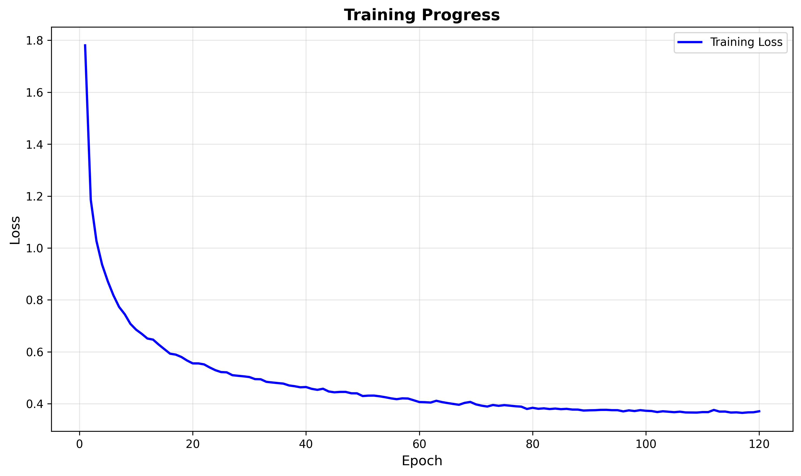
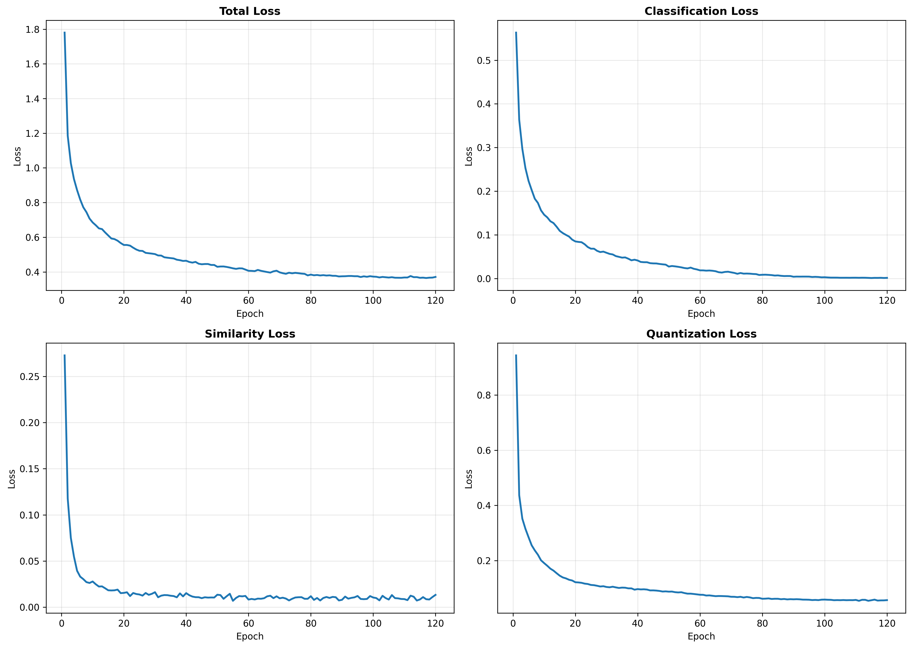
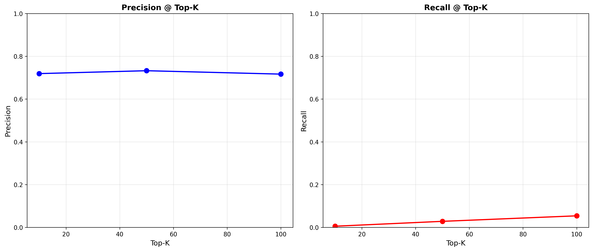
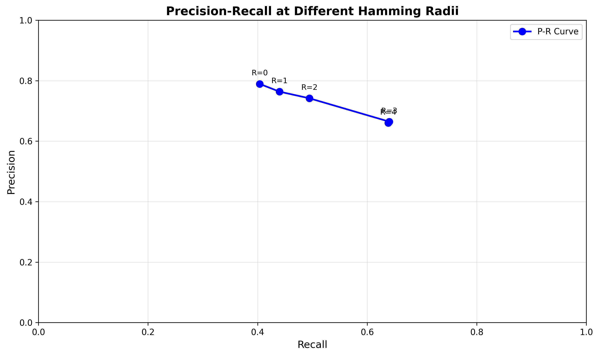

# BÁO CÁO HỘI ĐỒNG – Hệ thống CBIR hành vi lớp học (G-hash + GAT)

**Run tham chiếu:** `experiments/runs/20260420-115433`  
**Mục tiêu:** trình bày end-to-end từ chuẩn bị dữ liệu → mô hình → huấn luyện → đánh giá → kết quả.

---

## 1) Tóm tắt điều hành (Executive summary)

- Bài toán: xây dựng hệ thống **truy hồi ảnh theo nội dung (CBIR)** cho ảnh học sinh trong lớp học, phục vụ tìm kiếm nhanh các tình huống/hành vi (multi-label).
- Giải pháp: mô hình **G-hash** kết hợp:
  - **ViT (Vision Transformer)** trích xuất đặc trưng ảnh,
  - **Deep hashing** sinh mã nhị phân 64-bit để tìm kiếm cực nhanh bằng Hamming distance,
  - **GAT (Graph Attention Network)** học quan hệ tương quan giữa nhãn (co-occurrence) nhằm làm “ngữ nghĩa” nhãn ổn định hơn.
- Dữ liệu: ảnh crop học sinh chất lượng cao từ video lớp học (**Quality10k crops**) + gán **14 nhãn hành vi** (seed thủ công → teacher pseudo-label → review).
- Kết quả (đo trên tập test, database = train):
  - **Best epoch (45):** mAP = **0.7007**, mAP@10 = **0.9214**, P@10 = **0.7703**.
  - **Final model:** mAP = **0.6942**, mAP@10 = **0.8794**, P@10 = **0.7191**.
  - Lưu ý: best checkpoint đã được lưu tại `best_model.pth`.

---

## 2) Bài toán & tiêu chí đánh giá

### 2.1 Bài toán
Cho một ảnh truy vấn $q$ (học sinh / hành vi), hệ thống trả về danh sách ảnh $\{x\}$ trong “database” có **ngữ nghĩa gần** với $q$.

- Ảnh và nhãn là **multi-label** (một ảnh có thể có nhiều hành vi: ví dụ vừa *reading* vừa *head_down*).
- Mục tiêu thực tế: tra cứu nhanh tình huống, hỗ trợ thống kê, hỗ trợ người giám sát/giáo viên.

### 2.2 Vì sao dùng hashing?
- Với CBIR, database có thể tăng lên rất lớn. Thay vì so vector float 768-dim, hashing tạo mã 64-bit giúp:
  - **Tốc độ:** Hamming distance nhanh.
  - **Bộ nhớ:** 64-bit/ảnh rất nhỏ.
  - **Triển khai:** dễ index, dễ scale.

### 2.3 Metric đánh giá
Trong repo, “tương đồng” giữa query và database được định nghĩa là **chia sẻ ít nhất 1 nhãn**:
\[
S(q, x)=\mathbb{1}[y_q^\top y_x > 0]
\]

Trong đó $y_q, y_x \in \{0,1\}^{C}$ là vector **multi-hot** (C = số nhãn). Khi đó $y_q^\top y_x$ chính là **số nhãn trùng nhau** giữa query và ảnh trong DB, nên điều kiện $>0$ tương đương “có ít nhất 1 nhãn chung”.

Lưu ý: công thức trên chỉ dùng để định nghĩa **relevant/đúng** khi tính mAP, P@K, R@K; còn việc xếp hạng truy hồi thực tế dựa trên **Hamming distance** giữa các mã hash nhị phân.

Các metric chính:
- **mAP** và **mAP@K**: trung bình Average Precision theo mỗi query.
- **Precision@K (P@K)**: tỷ lệ ảnh đúng trong top-K.
- **Recall@K (R@K)**: phần trăm ảnh đúng được thu hồi so với tổng ảnh đúng trong database.

Ghi chú quan trọng: do multi-label nên số ảnh “relevant” cho mỗi query có thể rất nhiều → **Recall@K thường nhỏ** khi K nhỏ, đây là bình thường.

---

## 3) Dữ liệu: từ video → crop → nhãn → train/test

### 3.1 Chuẩn bị crop chất lượng cao từ video
**Script chính:** `crop_students_quality.py`

Pipeline:
1) Đọc video trong `data/ET-EDU/`.
2) Sampling theo thời gian (mặc định mỗi **2.5 giây** / frame).
3) Chạy detector người (YOLOv8, class=person).
4) Lọc theo chất lượng:
   - confidence ≥ **0.45**
   - min bbox size: width ≥ **96**, height ≥ **160**
   - area_ratio ≥ **0.008**
   - blur: Laplacian variance ≥ **45**
   - padding ratio 0.12 để giữ ngữ cảnh hành vi.
5) Chấm điểm “quality_score” dựa trên size + sharpness + conf.
6) Giữ mẫu theo 3 “bucket” khoảng cách (*near/mid/far*) để đa dạng:
   - near_ratio = 0.65, mid_ratio = 0.25, far_ratio = 0.10
   - near_area_ratio = 0.035, mid_area_ratio = 0.015
7) Xuất:
   - Ảnh crop vào `data/cropped_students_quality_10k/`
   - Metadata vào `data/cropped_students_quality_10k/metadata.csv`

Mục đích: đảm bảo dataset gồm các ảnh **rõ – đủ ngữ cảnh – đa dạng khoảng cách** để mô hình học ổn định.

Lệnh tái lập (tham khảo):
```bash
python crop_students_quality.py \
  --video-dir data/ET-EDU \
  --output-dir data/cropped_students_quality_10k \
  --metadata-csv data/cropped_students_quality_10k/metadata.csv \
  --target-count 10000 \
  --seconds-per-frame 2.5
```

### 3.2 Hệ nhãn (14 concepts)
**File:** `data/concepts.txt`

1. using_phone
2. dozing_off
3. turning_sideways
4. turning_back
5. raising_hand
6. opening_book
7. reading
8. writing
9. listening
10. head_down
11. sitting
12. standing
13. walking
14. interacting

### 3.3 Tạo nhãn: seed → teacher → pseudo-label → merge
**Script chính:** `teacher_pseudo_label_quality10k.py`

Mục tiêu: **giảm công gán nhãn thủ công** bằng pseudo-label nhưng vẫn **kiểm soát chất lượng** bằng seed và review.

**Input (đầu vào):**
- Ảnh crop đã chuẩn hóa chất lượng: `data/cropped_students_quality_10k/`
- Danh sách nhãn (14 concepts): `data/concepts.txt`
- Seed nhãn thủ công (≈500 ảnh): `data/seed_annotations_quality10k.csv`

**Quy trình (seed → teacher → pseudo-label → merge):**

**Bước 1 — Seed (gán nhãn thủ công, ít nhưng “chuẩn”):**
- Chọn ~500 ảnh **rõ, đa dạng bối cảnh/khung hình**, đại diện đủ các nhãn.
- Gán nhãn theo dạng **multi-label** (một ảnh có thể có nhiều nhãn).
- Output: `data/seed_annotations_quality10k.csv`

**Bước 2 — Train teacher (học từ seed):**
- Train mô hình phân loại multi-label (ResNet18) với **BCEWithLogitsLoss**.
- Dùng **pos_weight** để giảm ảnh hưởng mất cân bằng lớp.
- Cấu hình run tham chiếu:
  - epochs=18, lr=3e-4, batch=32, cosine LR.

**Bước 3 — Pseudo-label (dự đoán nhãn cho phần dữ liệu còn lại):**
- Chạy teacher lên toàn bộ ảnh crop, lấy xác suất cho 14 nhãn.
- Luật bật nhãn (run tham chiếu):
  - lấy **top-k=2** nhãn có xác suất cao nhất,
  - **threshold=0.35** để bật nhãn,
  - giới hạn **`max_per_class=2500`** để tránh một số lớp tràn dữ liệu.
- Output: `data/teacher_pseudo_quality10k.csv`

**Bước 4 — Merge (gộp seed + pseudo-label thành nhãn dùng huấn luyện):**
- Gộp nhãn seed (được xem là “chuẩn”) với nhãn pseudo.
- Nguyên tắc: **seed có ưu tiên cao hơn** nếu trùng ảnh (seed override pseudo).
- Output (file dùng cho các bước sau): `data/annotations_quality10k_teacher_merged.csv`

**Kiểm soát chất lượng (khuyến nghị trước khi “chốt” nhãn):**
- Review nhanh bằng người: `review_labels.py` (GUI kiểm tra ảnh + nhãn, sửa nhanh bằng phím tắt).
- Tập trung review:
  - các lớp hiếm (`dozing_off`, `opening_book`) để tránh thiếu positive,
  - các nhãn dễ nhầm do bối cảnh (`listening` vs `reading`, `head_down` vs `dozing_off`).

### 3.4 Chia train/test theo video để tránh leakage
**Script:** `build_etedu_split_from_csv.py`

Nguyên tắc:
- Deduplicate theo `Image_Path`.
- Nhóm theo video_id trích từ tên file (ví dụ: `D01_20240223064932`).
- Chọn tổ hợp video sao cho train ratio gần 0.8 và có ít nhất 2 video test.

**Dataset thực tế của run (data_root = `data`):**
- Train: **6,993** ảnh (`data/train_img.txt` + `data/train_label.txt`)
- Test: **1,750** ảnh (`data/test_img.txt` + `data/test_label.txt`)
- Train videos: 10, Test videos: 3

### 3.5 Phân bố nhãn (để hội đồng hiểu độ khó)
| Concept | Train+ | Test+ | Total+ |
|---|---:|---:|---:|
| using_phone | 809 | 42 | 851 |
| dozing_off | 97 | 2 | 99 |
| turning_sideways | 913 | 81 | 994 |
| turning_back | 337 | 71 | 408 |
| raising_hand | 197 | 27 | 224 |
| opening_book | 132 | 1 | 133 |
| reading | 245 | 21 | 266 |
| writing | 1332 | 65 | 1397 |
| listening | 195 | 4 | 199 |
| head_down | 734 | 158 | 892 |
| sitting | 2292 | 208 | 2500 |
| standing | 1555 | 945 | 2500 |
| walking | 1145 | 632 | 1777 |
| interacting | 228 | 189 | 417 |

Ghi chú:
- Dữ liệu bị **imbalance** mạnh (ví dụ: `dozing_off` chỉ 99 positives) → cần xử lý cân bằng trong loss.

---

## 4) Mô hình: G-hash (ViT + Hashing + GAT nhãn)

### 4.1 Tổng quan luồng xử lý
**File mô hình:** `src/models/ghash.py`

**Ý tưởng cốt lõi (1 câu):** biến mỗi ảnh thành **mã nhị phân 64-bit** để truy hồi nhanh bằng Hamming distance, đồng thời dùng **GAT trên đồ thị nhãn** để giúp không gian hash “hiểu” tương quan nhãn trong bài toán multi-label.

**Hai nhánh chạy song song khi huấn luyện:**
1) **Image stream (Ảnh → hash):**
   - Input: batch ảnh `images` có dạng (B, 3, 224, 224)
   - Output chính:
     - `img_features` (B, D): đặc trưng ảnh từ ViT
     - `img_hash` (B, 64): mã hash continuous trong [-1,1] (do tanh)
2) **Label stream (Nhãn → GAT → text-hash):**
   - Input: ma trận kề `adj_matrix` kích thước (C, C), với C=14
   - Output:
     - `enhanced_labels` (C, hidden_dim): đặc trưng nhãn sau khi “trộn ngữ nghĩa” bằng GAT
     - `txt_hash` (C, 64): mã hash prototype cho từng nhãn

**Nhánh phân loại (để có giám sát nhãn trực tiếp):**
- Từ `img_features` tạo `pred_labels` (B, 14) là **logits** multi-label (dùng cho BCEWithLogitsLoss).

**Truy hồi khi demo/inference (quan trọng để trình bày):**
- Lúc truy hồi chỉ cần **image stream** để sinh mã nhị phân:
  1) Ảnh query/gallery → ViT → `img_features`
  2) Hash head → mã 64-dim → **binarize bằng `sign`** → `binary_hash` ∈ {-1,+1}
  3) So sánh `binary_hash(query)` với `binary_hash(database)` bằng **Hamming distance**, xếp hạng và lấy top-K.

### 4.2 Image encoder (ViT)
**File:** `src/models/vision_encoder.py`
- Dùng backbone ViT pretrained từ `timm`:
  - `timm.create_model(model_name, pretrained=True, num_classes=0, global_pool='')`
  - `num_classes=0` nghĩa là bỏ head phân loại gốc, chỉ lấy feature.
- Forward:
  1) `features = backbone(images)`
  2) Nếu backbone trả về dạng token sequence (B, N, D) thì lấy **CLS token**: `features[:, 0]`.
     - Ý nghĩa: CLS token là đặc trưng tổng quát đại diện toàn ảnh, phù hợp để nhận diện hành vi.
  3) Kết quả `img_features` có dạng (B, D) (với `vit_base_patch16_224` thì thường D≈768).

### 4.3 Label graph + GAT
**Xây adjacency:** `src/data/label_graph.py`
- Input là nhãn train dạng multi-hot $Y \in \{0,1\}^{N\times C}$.
- Tính ma trận đồng xuất hiện (co-occurrence):
  - $N = Y^\top Y$  (tương ứng code: `co_matrix = labels.t() @ labels`) → kích thước (C, C)
  - $N_{i,j}$ = số ảnh mà label $i$ và $j$ cùng xuất hiện.
- Chuẩn hóa theo tần suất từng lớp (trong code):
  - $A_{i,j} = \dfrac{N_{i,j}}{\max(N_i,1)}$ với $N_i = \sum_n Y_{n,i}$
  - Sau đó đặt self-loop: $A_{i,i}=1$.
- Khi $A_{i,j}=0$ nghĩa là 2 nhãn gần như không đi cùng nhau → GAT sẽ **mask** cạnh đó.

**GAT:** `src/models/gat.py`
- Mỗi nhãn là 1 node; node feature ban đầu là embedding học được (TextEncoder) rồi chiếu qua MLP sang `hidden_dim`.
- Một lớp GAT làm 3 bước chính:
  1) Linear transform: $W h_i$.
  2) Tính điểm chú ý giữa node i và j:
     - $e_{i,j}=\mathrm{LeakyReLU}(a([Wh_i \| Wh_j]))$.
  3) Mask + softmax trên các hàng i để ra trọng số:
     - Nếu $A_{i,j}=0$ thì coi như không có cạnh (đặt điểm rất âm).
     - $\alpha_{i,j}=\mathrm{softmax}_j(e_{i,j})$.
     - Update node: $h'_i=\sum_j \alpha_{i,j} Wh_j$.
- Multi-head: tính nhiều head song song, concat/avg để ổn định hơn.

Ý nghĩa trình bày:
- GAT giúp nhãn “mượn ngữ cảnh” từ nhãn liên quan (ví dụ `writing` ↔ `sitting`) để tạo **prototype nhãn ổn định**.
- Prototype này đi vào `txt_hash` và được dùng trong loss để hướng dẫn `img_hash` học đúng ngữ nghĩa multi-label.

### 4.4 Hash head & classifier
**Hash head (ảnh → 64-bit):**
- Từ `img_features` (B, D) qua MLP:
  - LayerNorm → Linear(D→hidden_dim) → GELU → Dropout → Linear(hidden_dim→64)
- Trong `forward()` khi huấn luyện: áp `tanh` để ra mã continuous `img_hash` ∈ [-1,1].
  - Sau đó loss quantization (mục 5) sẽ ép giá trị tiến gần -1/+1 → dễ nhị phân hóa.
- Khi inference: dùng `generate_hash_code()`:
  - lấy `continuous_hash = img_hash_fc(img_features)` rồi `binary_hash = sign(continuous_hash)` (0 được set thành 1)
  - thu được mã nhị phân trong {-1,+1} để tính Hamming.

**Text-hash (nhãn → 64-bit):**
- `txt_hash = tanh(txt_hash_fc(enhanced_labels))` tạo prototype hash cho từng nhãn (C×64) phục vụ similarity loss.

**Classifier (ảnh → logits 14 nhãn):**
- Từ `img_features` tạo `pred_labels` (B, 14) là logits.
- Vai trò khi trình bày:
  - giúp mô hình học feature phân biệt hành vi tốt hơn (giám sát trực tiếp),
  - hỗ trợ kiểm tra trực quan (ảnh này model đoán nhãn nào).

---

## 5) Hàm mất mát (Loss) & lý do thiết kế

**File:** `src/training/losses.py` (class `GHashLoss`)

Tổng loss:
\[
\mathcal{L}=\gamma\,\mathcal{L}_{cls}+\alpha\,\mathcal{L}_{sim}+\eta\,\mathcal{L}_{ret}+\beta\,\mathcal{L}_{quant}+\mathcal{L}_{ortho}+\delta\,\mathcal{L}_{balance}
\]

Trong đó:
- $\mathcal{L}_{cls}$: BCEWithLogits (multi-label).
- $\mathcal{L}_{sim}$: margin-based loss trên cosine similarity giữa image-hash và text-hash theo nhãn đúng/sai.
- $\mathcal{L}_{ret}$: supervised image-image retrieval loss (ảnh cùng ≥1 nhãn là positive).
- $\mathcal{L}_{quant}$: ép mã continuous gần {-1,+1}.
- $\mathcal{L}_{ortho}$: ép các text-hash của nhãn khác nhau gần trực giao (giảm collapse).
- $\mathcal{L}_{balance}$: cân bằng bit cho ảnh (mean bit gần 0).

Cân bằng lớp:
- `train.py` ước lượng `pos_weight` từ train set, **capping 1..10** để tránh lớp hiếm bị bỏ qua.

---

## 6) Huấn luyện (Training) – cấu hình & quy trình

### 6.1 Cấu hình của run
Từ `experiments/runs/20260420-115433/metrics.txt`:
- Dataset: ET-EDU (data_root=`data`), image_size=224, num_classes=14
- Model:
  - ViT: `vit_base_patch16_224` (pretrained)
  - hash_bits=64
  - hidden_dim=512, dropout=0.15
  - text_embed_dim=300
- GAT: heads=4, layers=2, hidden_dim=256, dropout=0.15
- Training:
  - batch_size=32
  - lr=3e-5, weight_decay=1e-4
  - epochs=120, warmup_epochs=2
  - gradient clipping max_norm=5.0
  - scheduler: CosineAnnealingLR
  - early_stopping_patience=15 (đánh giá mỗi 5 epoch)

Ghi chú triển khai: `warmup_epochs` có trong config nhưng trainer hiện dùng CosineAnnealingLR **không có warmup explicit** (có thể bổ sung sau nếu cần).

### 6.2 Augmentation
**File:** `src/data/dataset.py` (transform_train)
- RandomResizedCrop(scale 0.85→1.0)
- HorizontalFlip
- ColorJitter(brightness/contrast 0.15)
- RandomRotation(10°)
- Normalize ImageNet mean/std

### 6.3 Quy trình train
**File:** `src/training/trainer.py`
- Build label co-occurrence graph từ train.
- Train theo epoch.
- Evaluate mỗi 5 epoch, lưu `best_model.pth` theo mAP.
- Periodic checkpoints mỗi 10 epoch.

---

## 7) Đánh giá & kết quả run 20260420-115433

### 7.1 Kết quả tổng hợp
**Best checkpoint (epoch 45):** `best_model.pth`

| Metric | Best (epoch 45) | Final | Ghi chú |
|---|---:|---:|---|
| mAP | 0.7007 | 0.6942 | best dùng để deploy |
| mAP@10 | 0.9214 | 0.8794 | top-10 rất mạnh |
| mAP@50 | 0.8706 | 0.8628 |  |
| mAP@100 | 0.8451 | 0.8275 |  |
| P@10 | 0.7703 | 0.7191 |  |
| R@10 | 0.00557 | 0.00540 | recall thấp do multi-label |
| P@50 | 0.7557 | 0.7326 |  |
| R@50 | 0.02747 | 0.0283 |  |
| P@100 | 0.7390 | 0.7167 |  |
| R@100 | 0.05277 | 0.0540 |  |

**Giải thích “P cao nhưng R thấp”**
- Mỗi query có thể có rất nhiều ảnh relevant trong database (chia sẻ ≥1 label).
- K=10/50/100 chỉ lấy rất ít so với tổng relevant → recall nhỏ là bình thường.

### 7.2 Biểu đồ trực quan
Các hình đã có sẵn trong thư mục run:

- Training curves: `training_curves.png`



- Loss components: `loss_components.png`



- Top-K metrics: `topk_metrics.png`



- Precision–Recall theo Hamming radius: `pr_curve.png`



### 7.3 Nhận xét kỹ thuật từ đường cong
- Loss giảm ổn định → học được đặc trưng.
- Classification loss về gần 0 → mô hình phân biệt nhãn tốt trên train.
- Quantization loss giảm → mã hash tiến gần nhị phân → phù hợp tìm kiếm.
- Best mAP xuất hiện sớm (epoch 45), sau đó dao động nhẹ → có thể do:
  - label noise / imbalance,
  - overfitting nhẹ về retrieval,
  - metric nhạy theo split.

---

## 8) Cách tái lập (Reproducibility)

### 8.0 (Tùy chọn) Review nhãn bằng người
Nếu muốn kiểm tra/sửa nhãn trước khi build split:
```bash
python review_labels.py \
  --csv-file data/annotations_quality10k_teacher_merged.csv \
  --data-root data \
  --save-path data/annotations_quality10k_teacher_reviewed.csv
```
Sau đó dùng file `annotations_quality10k_teacher_reviewed.csv` cho bước build train/test.

### 8.1 Tạo nhãn teacher-merged (nếu cần)
```bash
python teacher_pseudo_label_quality10k.py \
  --seed-csv data/seed_annotations_quality10k.csv \
  --input-dir data/cropped_students_quality_10k \
  --merged-output-csv data/annotations_quality10k_teacher_merged.csv
```

### 8.2 Build train/test txt
```bash
python build_etedu_split_from_csv.py \
  --csv-file data/annotations_quality10k_teacher_merged.csv \
  --output-root data
```

### 8.3 Train
```bash
python train.py --config configs/et_edu_config.yaml
```

### 8.4 Demo truy hồi (CBIR) từ checkpoint tốt nhất
Ví dụ chạy inference cho 1 ảnh truy vấn (thay `PATH_TO_QUERY.jpg` bằng ảnh bạn chọn):
```bash
python inference.py \
  --checkpoint experiments/runs/20260420-115433/best_model.pth \
  --config configs/et_edu_config.yaml \
  --mode retrieve \
  --image PATH_TO_QUERY.jpg \
  --database data/train_img.txt \
  --top-k 5 \
  --save-viz
```

Sau khi train xong sẽ sinh thư mục `experiments/runs/YYYYMMDD-HHMMSS/` với `best_model.pth`, `metrics.txt`, và các biểu đồ.

---

## 9) Outline thuyết trình (10–12 slide) + lời thoại gợi ý

### Slide 1 – Bối cảnh & mục tiêu
- Vấn đề: khó tra cứu hành vi trong video/ảnh lớp học.
- Mục tiêu: CBIR theo hành vi, trả kết quả nhanh.

**Lời thoại:** “Thay vì xem video thủ công, hệ thống cho phép nhập một ảnh truy vấn và tìm các ảnh tương tự theo hành vi trong vài mili-giây.”

### Slide 2 – Dữ liệu & nhãn
- Nguồn: video lớp học.
- Crop học sinh bằng YOLO.
- 14 nhãn hành vi.

### Slide 3 – Chuẩn bị dữ liệu (pipeline)
- Sampling theo thời gian.
- Lọc chất lượng (sharpness/size/conf).
- Bucket near/mid/far.

### Slide 4 – Gán nhãn (seed → teacher → pseudo)
- Seed 500 ảnh.
- Teacher ResNet18.
- Pseudo-label có kiểm soát + max_per_class.

### Slide 5 – Ý tưởng chính của G-hash
- ViT trích đặc trưng.
- Hashing 64-bit.
- Hamming retrieval.

### Slide 6 – GAT cho quan hệ nhãn
- Co-occurrence graph.
- Attention giữa nhãn.
- Vì sao giúp retrieval tốt hơn.

### Slide 7 – Loss thiết kế để “không sập hash”
- cls / sim / retrieval / quant.
- orthogonality + bit balance.

### Slide 8 – Thực nghiệm & cấu hình
- Batch 32, lr 3e-5, epochs 120.
- Augmentation.

### Slide 9 – Kết quả
- mAP, P@K, R@K.
- Best epoch 45.
- Show biểu đồ topk_metrics + pr_curve.

### Slide 10 – Demo + hạn chế + hướng phát triển
- Demo inference (query → topK).
- Hạn chế: imbalance, label noise, test positives hiếm.
- Roadmap: tăng dữ liệu, tăng quality labeling, rerank diversity.

---

## 10) Câu hỏi hội đồng hay hỏi & câu trả lời chuẩn bị sẵn

1) **Vì sao không dùng vector embedding và FAISS, mà lại hashing?**  
- Hashing giảm bộ nhớ và tăng tốc cho hệ thống lớn; triển khai đơn giản (bit operations) và phù hợp realtime.

2) **GAT có đóng góp gì?**  
- Học tương quan nhãn giúp model phân biệt hành vi tốt hơn trong bối cảnh multi-label, giảm nhiễu khi các hành vi thường đi kèm.

3) **Tại sao Recall@K nhỏ?**  
- Multi-label khiến số relevant items rất lớn; top-10 chỉ lấy một phần nhỏ → recall nhỏ là hợp lý. Cần xem mAP và P@K để đánh giá chất lượng xếp hạng.

4) **Nguy cơ leakage giữa train/test?**  
- Split theo video_id để tránh cùng phiên lớp học xuất hiện ở cả train và test.

5) **Hướng nâng cấp?**  
- Tăng dữ liệu query, cân bằng nhãn hiếm (`dozing_off`, `opening_book`), tăng review thủ công cho pseudo-label, và cải thiện rerank đa dạng (MMR).

---

## 11) Phụ lục: file liên quan trong repo

- Run artifacts: `experiments/runs/20260420-115433/`
- Config: `configs/et_edu_config.yaml`
- Data split: `data/train_img.txt`, `data/train_label.txt`, `data/test_img.txt`, `data/test_label.txt`
- Concepts: `data/concepts.txt`
- Crop pipeline: `crop_students_quality.py`
- Pseudo label: `teacher_pseudo_label_quality10k.py`
- Split builder: `build_etedu_split_from_csv.py`
- Model: `src/models/ghash.py`, `src/models/gat.py`, `src/models/vision_encoder.py`
- Loss: `src/training/losses.py`
- Train loop: `src/training/trainer.py`
- Metrics: `src/evaluation/metrics.py`
