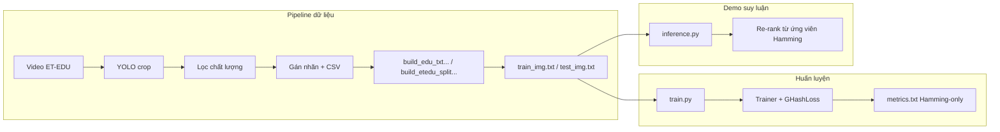

# BÁO CÁO SẢN PHẨM — HỆ CBIR ĐA NHÃN ET-EDU (G-HASH)

| Mục | Nội dung |
|-----|----------|
| **Phiên bản báo cáo** | 2026 — bản có **dẫn chứng mã** |
| **Run tham chiếu** | `experiments/runs/20260420-115433` |
| **Dữ liệu / lớp** | ET-EDU, **14 nhãn** đa nhãn (multi-hot) |
| **Mục đích** | Thuyết trình hội đồng: chứng minh luồng logic từ dữ liệu → huấn luyện → metric → demo suy luận (có chỉ vào đúng file/hàm trong repo) |

---

## 1. Chuỗi logic tổng thể (một nhìn)

Sản phẩm chia thành **ba nhánh có thể trình bày lần lượt**:

1. **Dữ liệu:** Video lớp → crop người → lọc chất lượng → gán nhãn (tay / CLIP / teacher) → **CSV một nhất** → script chia **theo video** → file `train_img.txt` / `train_label.txt` và `test_*.txt` nằm dưới `data/` (Hoặc cấu hình trong `configs/et_edu_config.yaml`: `dataset.data_root: "data"`).
2. **Huấn luyện:** `train.py` đọc YAML → `create_data_loaders` → `GHashModel` + `GHashLoss` + `Trainer`; lưu `best_model.pth`, `metrics.txt` trong `experiments/runs/<timestamp>/`.
3. **Đánh giá offline:** trong `Trainer.evaluate()`, **ranking chỉ dùng mã nhị phân + Hamming** (khớp định nghĩa trong `compute_retrieval_metrics`).  
4. **Demo / sản phẩm:** `inference.py` thêm **giai đoạn 2**: re-rank ứng viên sau Hamming thô (khác với bước (3) — cần nói rõ khi hội đồng hỏi “metric có rerank không”).



---

## 2. Bảng dẫn chứng: mỗi bước nối với đâu trong code

| Bước nghiệp vụ | File / địa điểm chính | Vai trò ngắn gọn |
|----------------|---------------------|-------------------|
| Cấu hình ET-EDU 14 lớp, loss, eval | `configs/et_edu_config.yaml` | `dataset.name: ET-EDU`, `num_classes: 14`, loss weights, `database_split`, `evaluation` (trong báo cáo run cụ thể còn có snapshot trong `metrics.txt`). |
| Chia train/test **theo video** | `build_etedu_split_from_csv.py` | Gom ảnh theo `video_id_from_path`, duyệt tổ hợp để ~80% train, tối thiểu số clip test (`min_test_videos`). |
| Đổi CSV → txt cho loader | `build_edu_txt_from_labeled_csv.py` | Chuẩn hóa định dạng mà `NUSWIDE2Dataset` đọc được. |
| Nạp ảnh + nhãn multi-hot | `src/data/dataset.py` | Class `NUSWIDE2Dataset`: nếu `dataset_name == "ET-EDU"` thì đọc `train_img.txt` + `train_label.txt` (train) và `test_*` (test/query). |
| Đồ thị đồng xuất hiện nhãn | `src/data/label_graph.py` | `build_label_cooccurrence_matrix` → ma trận kề cho GAT. |
| Trainer dựng loader “database = train” khi đánh giá | `src/training/trainer.py` | `_create_database_eval_loader`, `evaluate()`. |
| Loss tổng hợp | `src/training/losses.py` | `GHashLoss`: classification + similarity + retrieval + quant + orthogonal + bit balance. |
| Kiến trúc ViT + GAT + hash | `src/models/ghash.py` | `GHashModel.forward`, `generate_hash_code`. |
| Metric mAP / P@K / R@K | `src/evaluation/metrics.py` | `compute_retrieval_metrics`, `mean_average_precision`, ground truth **“cùng ít nhất một nhãn”**. |
| Entry train | `train.py` | `compute_pos_weight`, `GHashLoss(...)`, `Trainer.train()`, `create_experiment_report`. |
| Suy luận + rerank UI | `inference.py` | Hamming coarse → rerank blending scores. |

**Lệnh huấn luyện đại diện (ví dụ):**

```bash
python train.py --config configs/et_edu_config.yaml
```

(Snapshot run `20260420-115433` được lưu trong `metrics.txt`; thư mục run chứa mô hình tốt nhất tại thời điểm huấn luyện.)

---

## 3. Chuẩn bị dữ liệu (ngoài và trong repo)**

### 3.1. Video → crop học sinh

- Video gốc: thường `data/ET-EDU` (mặc định trong nhiều script, ví dụ `prepare_video_dataset.py`, `crop_students_quality.py`).
- **Dẫn chứng:** script crop / chất lượng — `crop_students_quality.py` (tham số `--video-dir` mặc định trỏ `data/ET-EDU`).
- Pipeline từng bước chi tiết hơn (frame thô → crop): `step1_extract_frames.py`, `step1b_crop_persons.py`, `step2_build_dataset.py` — phù hợp khi trình bày “tách module tiền xử lý”.

### 3.2. Gán nhãn và chuẩn hóa định dạng

- Gán tay / Label Studio / CSV: thư mục `labeling/` và `ET_EDU_CBIR_V2_RUNBOOK.md` mô tả luồng **ET-EDU-CBIR-V2** nếu dự án dùng bản V2 (`extract_edu_cbir_v2.py`, `build_edu_txt_from_labeled_csv.py`).
- Sau khi có CSV nhãn, **chia theo video** tránh rò khung hình cùng clip:

```49:79:build_etedu_split_from_csv.py
    by_video = defaultdict(list)
    for r in uniq:
        by_video[video_id_from_path(r[0])].append(r)

    videos = list(by_video.keys())
    sizes = {v: len(by_video[v]) for v in videos}
    n_total = len(uniq)
    target_train = args.target_train_ratio * n_total

    best = None
    for k in range(1, len(videos)):
        for combo in itertools.combinations(videos, k):
            train_v = set(combo)
            test_v = len(videos) - len(train_v)
            if test_v < args.min_test_videos:
                continue
            train_n = sum(sizes[v] for v in train_v)
            score = abs(train_n - target_train)
            if best is None or score < best[0]:
                best = (score, train_v, train_n)

    if best is None:
        raise RuntimeError("Cannot find valid video-group split with current constraints.")

    _, train_videos, train_n = best
    train_rows, test_rows = [], []
    for vid, block in by_video.items():
        if vid in train_videos:
            train_rows.extend(block)
        else:
            test_rows.extend(block)
```

**Ý nghĩa thuyết trình:** “Chúng em không xáo trộn ảnh độc lập; toàn bộ ảnh thuộc một **video_id** nằm cùng train **hoặc** cùng test — giảm học vẹt theo bối cảnh clip.”

---

## 4. Loader dữ liệu và tiền xử lý tensor

Với `dataset.name == "ET-EDU"`, train/test đọc đúng cặp file txt:

```16:22:src/data/dataset.py
        if dataset_name == "ET-EDU":
            if split == "database":
                img_file = self.data_root / "train_img.txt"
                label_file = self.data_root / "train_label.txt"
            else:
                img_file = self.data_root / "test_img.txt"
                label_file = self.data_root / "test_label.txt"
```

`create_data_loaders` tạo **ba** loader: train (shuffle), test, query (cùng file test nhưng dùng cho nhánh “query” khi đánh giá):

```82:91:src/data/dataset.py
    dataset_name = config['dataset'].get('name', 'NUS-WIDE 2')
    
    train_dataset = NUSWIDE2Dataset(data_root, split="database", transform=transform_train, dataset_name=dataset_name)
    test_dataset = NUSWIDE2Dataset(data_root, split="test", transform=transform_test, dataset_name=dataset_name)
    query_dataset = NUSWIDE2Dataset(data_root, split="test", transform=transform_test, dataset_name=dataset_name)
    
    train_loader = DataLoader(train_dataset, batch_size=batch_size, shuffle=True, num_workers=num_workers)
    test_loader = DataLoader(test_dataset, batch_size=batch_size, shuffle=False, num_workers=num_workers)
    query_loader = DataLoader(query_dataset, batch_size=batch_size, shuffle=False, num_workers=num_workers)
```

**Augmentation train** (RandomResizedCrop, flip, ColorJitter, rotation) nằm trong cùng hàm — đây là “dẫn chứng” cho câu *tăng cường biến thể lớp học* khi hội đồng hỏi.

---

## 5. Đồ thị nhãn và luồng forward G-hash

### 5.1. Ma trận đồng xuất hiện

```4:27:src/data/label_graph.py
def build_label_cooccurrence_matrix(labels):
    """
    Build label co-occurrence adjacency matrix from labels
    Args:
        labels: Tensor of shape (N, C) containing binary labels
    Returns:
        adj_matrix: Tensor of shape (C, C) containing co-occurrence probabilities
    """
    labels = labels.float()
    
    # Calculate co-occurrence matrix N(i,j)
    co_matrix = torch.matmul(labels.t(), labels) # (C, C)
    
    # Count of each class N(j)
    class_counts = labels.sum(dim=0).unsqueeze(1) # (C, 1)
    class_counts[class_counts == 0] = 1 # Avoid division by zero
    
    # Calculate conditional probabilities P(i|j) = N(i,j) / N(i)
    adj_matrix = co_matrix / class_counts
    
    # Add self loops
    adj_matrix.fill_diagonal_(1.0)
    
    return adj_matrix
```

`Trainer.__init__` gọi `_build_adjacency_matrix()` để có `adj_matrix` phục vụ batch.

### 5.2. Forward ViT → hash ảnh; embedding nhãn → GAT → hash nhãn; classifier

Đoạn cốt lõi trong `GHashModel.forward`:

```87:104:src/models/ghash.py
        batch_size = images.size(0)
        
        # ===== Image Path =====
        # Extract image features using ViT
        img_features = self.image_encoder(images)  # (B, img_feat_dim)
        
        # Generate image hash codes
        img_hash = torch.tanh(self.img_hash_fc(img_features))  # (B, hash_bits)
        
        # ===== Label Path =====
        # Get all label embeddings
        label_embeddings = self.text_encoder()  # (num_classes, hidden_dim)
        
        # Apply GAT to learn label correlations
        enhanced_labels = self.gat(label_embeddings, adj_matrix)  # (num_classes, hidden_dim)
        
        # Generate text hash codes for all labels
        txt_hash = torch.tanh(self.txt_hash_fc(enhanced_labels))  # (num_classes, hash_bits)
```

Sinh mã nhị phân **khi đánh giá / suy luận** (đưa về ±1):

```123:137:src/models/ghash.py
    def generate_hash_code(self, images):
        """
        Generate binary hash codes for images (inference mode)
        ...
            Binary hash codes (B, hash_bits) in {-1, +1}
        """
        self.eval()
        with torch.no_grad():
            img_features = self.image_encoder(images)
            continuous_hash = self.img_hash_fc(img_features)
            binary_hash = torch.sign(continuous_hash)
```

---

## 6. Hàm mất và cân nhãn (dẫn chứng)

### 6.1. Khởi tạo `GHashLoss` + `pos_weight` trong `train.py`

Trọng số dương theo lớp (tránh siêu lệch nhãn hiếm) được **ước từ train set** và clamp:

```29:41:train.py
def compute_pos_weight(train_loader, device):
    """Estimate per-class positive weights from the training set."""
    dataset_labels = getattr(train_loader.dataset, 'labels', None)
    if dataset_labels is None:
        return None

    labels = torch.as_tensor(np.asarray(dataset_labels), dtype=torch.float32)
    pos_counts = labels.sum(dim=0)
    neg_counts = labels.size(0) - pos_counts

    pos_weight = neg_counts / torch.clamp(pos_counts, min=1.0)
    pos_weight = torch.clamp(pos_weight, min=1.0, max=10.0)
    return pos_weight.to(device)
```

### 6.2. Công thức tổng loss (trích đoạn)

```45:81:src/training/losses.py
        # 1. Classification Loss
        loss_cls = self.bce_loss(pred_labels, true_labels)
        ...
        loss_sim = self.similarity_loss(img_hash, txt_hash, true_labels)
        loss_retrieval = self.image_retrieval_loss(img_hash, true_labels)
        ...
        loss_quant_img = self.quantization_loss(img_hash)
        loss_quant_txt = self.quantization_loss(txt_hash)
        loss_quant = loss_quant_img + loss_quant_txt
        ...
        loss_ortho = F.mse_loss(txt_sim, eye) * 2.0  # ...
        ...
        loss_bit_balance = torch.mean(img_hash.mean(dim=0) ** 2)
        
        # Total loss
        total_loss = (self.gamma * loss_cls + 
                     self.alpha * loss_sim + 
                     self.eta * loss_retrieval +
                     self.beta * loss_quant +
                     loss_ortho +
                     self.delta * loss_bit_balance)
```

Tham số `gamma_classification`, `alpha_similarity`, `eta_retrieval`, `beta_quantization`, `delta_bit_balance` trùng với YAML run (xem phần 9).

---

## 7. Đánh giá trong huấn luyện: **chỉ Hamming + multi-label similarity**

Đây là điểm quan trọng để trả lời hội đồng: **`metrics.txt` không dùng re-rank**; re-rank nằm ở `inference.py`.

### 7.1. Database = train khi `database_split == "train"`

```161:171:src/training/trainer.py
        database_split = self.config.get('evaluation', {}).get('database_split', 'train')
        ...
            database_loader = self.database_eval_loader if database_split == 'train' else self.test_loader
            for images, labels, _ in tqdm(database_loader, desc="Database encoding"):
                ...
                codes = self.model.generate_hash_code(images)
```

`_create_database_eval_loader` sao chép dataset train và **đổi transform sang giống query** để không lệch aug khi đánh giá.

### 7.2. Gọi metric

```193:196:src/training/trainer.py
        metrics = compute_retrieval_metrics(
            query_codes, db_codes, query_labels, db_labels,
            top_k_list=self.config['evaluation']['top_k']
        )
```

Ground truth “relevant”:

```46:49:src/evaluation/metrics.py
    # Two samples are similar if they share at least one label
    similarity = (labels1 @ labels2.T) > 0
```

→ **mAP và P/R@K trong báo cáo** được định nghĩa trên **ít nhất một nhãn trùng** giữa query và ảnh trong kho.

---

## 8. Demo sản phẩm: `inference.py` — Hamming thô → re-rank

Config ET-EDU có `rerank_k`, MMR… (`configs/et_edu_config.yaml`), nhưng **đoạn blend điểm** nằm trong inference:

```315:347:inference.py
        # Stage 1: fast coarse search using Hamming distance.
        ...
        coarse_k = min(max(top_k * 10, self.rerank_k), len(self.database_images))
        ...
        # Stage 2: rerank with continuous hash + predicted label distributions.
        ...
        rerank_scores = 0.55 * feature_scores + 0.30 * label_scores + 0.15 * hamming_scores
```

**Thuyết trình gọn:** Offline metric = chỉ nhánh Hamming như học báo hashing; Demo = Hai tầng để UX tốt hơn.

---

## 9. Snapshot cấu hình & kết quả run `20260420-115433`

Chi tiết trong `metrics.txt` cùng thư mục. Giá trị chính:

| Nhóm | Giá trị (tóm tắt) |
|------|-------------------|
| `dataset.name` | ET-EDU, `num_classes: 14`, `data_root: data` |
| Model | ViT `vit_base_patch16_224`, `hash_bits: 64`, GAT 2 lớp / 4 heads, `gat.hidden_dim: 256`, `model.hidden_dim: 512` |
| Loss weights | như snapshot (gamma 1.5, alpha 0.3, beta 0.1, delta 1.0, eta 0.5) |
| **Metric** | mAP@10 0.8794, mAP@50 0.8628, mAP@100 0.8275, **mAP 0.6942**, P/R@10, @50, @100 như file |

Giải thích **R@K thấp** (đã có trong báo cáo trước, nay có thêm chứng trong mã):

- Recall@K = (số relevant trong top-K) / (tổng số relevant **trên toàn database** có cùng nhãn với query) — trong khoảng chứa hàng ngàn ảnh train, **mẫu thật của query có thể rất nhiều**, nên tỉ lệ thường nhỏ dù Precision@K vẫn cao.

---

## 10. Hạn chế và hướng mở (gắn mã)**

| Vấn đề | Liên quan trong code / quy trình |
|--------|----------------------------------|
| Phụ thuộc nhãn nhiễu / pseudo | CSV → `train_label.txt`; cải thiện bằng lọc nhãn, review trong `labeling/`. |
| Lớp hiếm | `pos_weight` chỉ một phần; có thể cần sampling hoặc thu nhãn tay riêng. |
| Metric vs demo | Tách rõ §7 và §8 trước hội đồng. |
| Chuẩn hóa hai miền dữ liệu V2 vs CROPPED-PERSONS | Nhiều script (`ET_EDU_CBIR_V2_*`, `ET-EDU-CROPPED-PERSONS`) — cần nói rõ trong luận văn dùng **nhánh pipeline nào** cho run này. |

---

## 11. Gợi ý slide (“mỗi slide = một chỗ trong repo”)**

| Slide | Nội dung | Đối chứng |
|-------|----------|-----------|
| 1 | Vấn đề CBIR đa nhãn lớp học | — |
| 2 | Video → crop → CSV → split theo video | `build_etedu_split_from_csv.py` |
| 3 | Loader + augment | `src/data/dataset.py` |
| 4 | GHashModel (ViT, GAT, hash) | `src/models/ghash.py` |
| 5 | Loss + pos_weight | `train.py`, `src/training/losses.py` |
| 6 | Metric Hamming + định nghĩa relevant | `src/evaluation/metrics.py` |
| 7 | Kết quả `metrics.txt` | run `20260420-115433` |
| 8 | Demo re-rank | `inference.py` |

---

## 12. Tệp tham chiếu nhanh

| Tệp | Ghi chú |
|-----|---------|
| `experiments/runs/20260420-115433/metrics.txt` | Snapshot config + số đo |
| `configs/et_edu_config.yaml` | YAML ET-EDU đầy đủ (14 lớp, eval, MMR cho inference) |
| Báo cáo này | `experiments/runs/20260420-115433/BAO_CAO_THUYET_TRINH_ET_EDU.md` |

---

*Bản báo cáo này cố ý lồng **trích dẫn mã** để khi thuyết trình bạn có thể mở đúng file và chỉ vào hàm tương ứng — phù hợp yêu cầu “logic có dẫn chứng code”.*
